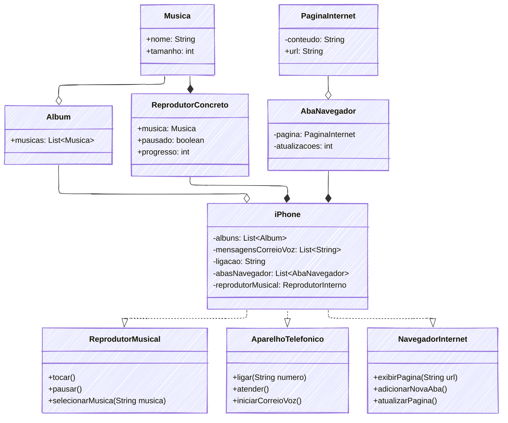

# [Desafio POO](https://github.com/digitalinnovationone/trilha-java-basico/tree/main/desafios/poo)

# Resolução: Diagrama de Classes

```mermaid
---
config:
  look: handDrawn
  layout: elk
  theme: mc
---
classDiagram
direction BT

class iPhone {
    -albuns: List~Album~
    -mensagensCorreioVoz: List~String~
    -ligacao: String
    -abasNavegador: List~AbaNavegador~
    -reprodutorMusical: ReprodutorInterno
}

class ReprodutorMusical {
    +tocar()
    +pausar()
    +selecionarMusica(String musica)
}

class AparelhoTelefonico {
    +ligar(String numero)
    +atender()
    +iniciarCorreioVoz()
}

class NavegadorInternet {
    +exibirPagina(String url)
    +adicionarNovaAba()
    +atualizarPagina()
}

class Album {
    +musicas: List~Musica~
}

class Musica {
    +nome: String
    +tamanho: int
}

class ReprodutorConcreto {
    +musica: Musica
    +pausado: boolean
    +progresso: int
}

class PaginaInternet {
    -conteudo: String
    +url: String
}

class AbaNavegador {
    -pagina: PaginaInternet
    -atualizacoes: int
}

ReprodutorConcreto *-- Musica
Album o-- Musica
iPhone o-- Album
iPhone *-- AbaNavegador
iPhone *-- ReprodutorConcreto
AbaNavegador o-- PaginaInternet
ReprodutorMusical <|.. iPhone
AparelhoTelefonico <|.. iPhone
NavegadorInternet <|.. iPhone
```
